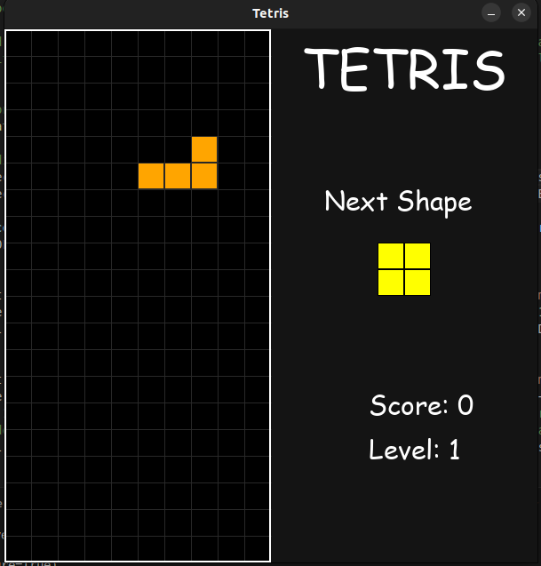

# Tetris DIY

A classic Tetris clone built with Python and Pygame.


**This repository is a test project for Gemini Antigravity AI agent. Totally generated by Gemini and all the modifications are made by Gemini via USER PROMPT.**

## Features

*   **Classic Gameplay**: Authentic Tetris mechanics with all 7 tetromino shapes.
*   **Dynamic Difficulty**: Speed increases as you level up by clearing lines.
*   **Scoring System**: Earn more points by clearing multiple lines at once.
*   **Next Piece Preview**: Plan ahead by seeing the upcoming tetromino.
*   **Local Leaderboard**: Save and view the top 10 high scores.
*   **Pause Function**: Press 'P' to pause the game at any time.
*   **Background Music**: Enjoy the classic Tetris theme while playing.

## Installation

1.  **Prerequisites**: Ensure you have Python 3 installed.
2.  **Clone the repository**:
    ```bash
    git clone git@github.com:Labujuice/Tetris-natural-birth.git
    cd Tetris-natural-birth
    ```
3.  **Install Dependencies**:
    ```bash
    pip install pygame
    ```

## How to Play

Run the game from the terminal:

```bash
python3 main.py
```

### Controls

| Key | Action |
| :--- | :--- |
| **Left Arrow** | Move Left |
| **Right Arrow** | Move Right |
| **Down Arrow** | Soft Drop (Fall Faster) |
| **Up Arrow** | Rotate Piece |
| **Space** | Hard Drop (Instant Drop) |
| **P** | Pause / Unpause |

### Game Over
When the game ends, type your name and press **Enter** to save your score to the leaderboard.

## Project Structure

*   `main.py`: Entry point of the game.
*   `game.py`: Main game logic controller.
*   `grid.py`: Handles the game board and collision detection.
*   `tetromino.py`: Defines piece shapes and movement.
*   `ui.py`: Handles drawing text and game interface.
*   `leaderboard.py`: Manages saving and loading high scores.
*   `settings.py`: Configuration constants (colors, dimensions, speed).
    *   `DRAW_GRID_LINES_ON_PIECE`: Toggle grid lines on the active piece.

## Credits

*   **Background Music**: [Tetris Theme (Korobeiniki)](https://www.youtube.com/watch?v=VbWleUwTihc&list=PLPHLNVBw2pV598SPvMFKRmWH8-oEq7UfR)
